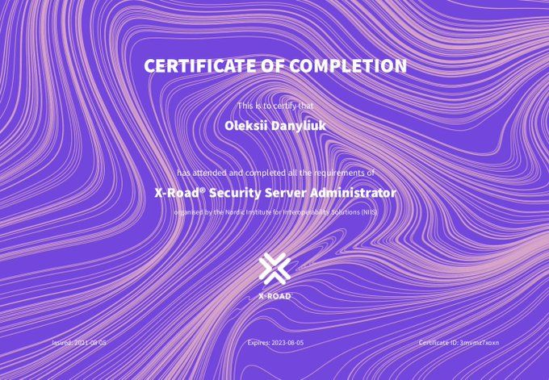

## Hi there 👋

I'm Oleksii, a Cloud and Software Engineer.

### Certifications

  

  

## Me in the WWW

[//]: <> (Icons from https://simpleicons.org)

  

### 📊 My Github Stats

|  |  |
|:--------------------------------------------------------------------------------------------------------------------------:|:----------------------------------------------------------------------------------------------------------------:|

<!--
**oleksiidn/oleksiidn** is a ✨ _special_ ✨ repository because its `README.md` (this file) appears on your GitHub profile.

Here are some ideas to get you started:

- 🔭 I’m currently working on ...
- 🌱 I’m currently learning ...
- 👯 I’m looking to collaborate on ...
- 🤔 I’m looking for help with ...
- 💬 Ask me about ...
- 📫 How to reach me: ...
- 😄 Pronouns: ...
- ⚡ Fun fact: ...
-->
